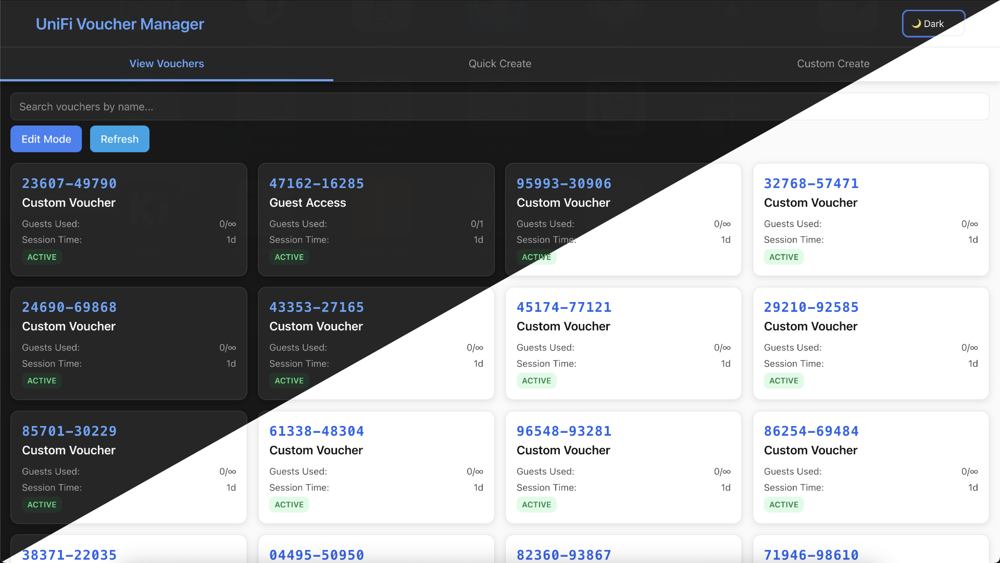

# WiFi Voucher Manager

[](https://hub.docker.com/r/etiennecollin/unifi-voucher-manager)

A modern, touch-friendly web application for managing WiFi vouchers on UniFi controllers.
Perfect for businesses, cafes, hotels, and home networks that need to provide guest WiFi access.



<!-- vim-markdown-toc GFM -->

- [✨ Features](#-features)
  - [🎫 Voucher Management](#-voucher-management)
  - [🎨 Modern Interface](#-modern-interface)
  - [🔧 Technical Features](#-technical-features)
    - [🏗 Architecture](#-architecture)
- [🚀 Quick Start](#-quick-start)
  - [🐳 Using Docker Compose (Recommended)](#-using-docker-compose-recommended)
  - [⚙️ Without Docker](#-without-docker)
- [⚙️ Configuration](#-configuration)
  - [Environment Variables](#environment-variables)
  - [Getting UniFi API Credentials](#getting-unifi-api-credentials)
- [🤝 Contributing](#-contributing)
  - [Development Guidelines](#development-guidelines)
  - [Code Style](#code-style)
- [🐛 Troubleshooting](#-troubleshooting)
  - [Common Issues](#common-issues)
    - [Vouchers not appearing or connection issue to UniFi controller](#vouchers-not-appearing-or-connection-issue-to-unifi-controller)
    - [Application won't start](#application-wont-start)
  - [Getting Help](#getting-help)

<!-- vim-markdown-toc -->

## ✨ Features

### 🎫 Voucher Management

- **Quick Create** - Generate guest vouchers with preset durations (1 hour to 1 week)
- **Custom Create** - Full control over voucher parameters:
  - Custom name
  - Duration (minutes to days)
  - Guest count limits
  - Data usage limits
  - Upload/download speed limits
- **View All Vouchers** - Browse and search existing vouchers by name
- **Search Vouchers** - Search vouchers by name
- **Bulk Operations** - Select and delete multiple vouchers
- **Auto-cleanup** - Remove expired vouchers with a single click

### 🎨 Modern Interface

- **Touch-Friendly** – Optimized for tablet, mobile, and desktop.
- **Dark/Light Mode** – Follows system preference, with manual override.
- **Responsive Design** - Works seamlessly across all screen sizes
- **Smooth Animations** – Semantic transitions for polished UX.
- **Real-time Notifications** - Instant feedback for all operations

### 🔧 Technical Features

- **Docker Ready** - Easy deployment with Docker Compose and included healthcheck
- **UniFi Integration** - Direct API connection to UniFi controllers

#### 🏗 Architecture

This application is built with a clear separation of concerns:

1. **Frontend**: A Next.js 14 application (TypeScript + Tailwind CSS) that provides a responsive, touch-friendly UI.
2. **Backend**: A Rust service powered by [Axum](https://github.com/tokio-rs/axum) that exposes a JSON API.
3. **UniFi Controller**: The Axum backend securely communicates with your UniFi controller’s API, isolating API keys from the user-facing frontend.

```text
                                    {                          DOCKER                         }
[User Browser] <––– HTTP/HTTPS –––> [Next.js Frontend] <––– HTTP/HTTPS –––> [Axum Rust Backend] <––– HTTPS –––> [UniFi Controller]
```

- The frontend only knows about the backend API endpoint.
- All UniFi credentials and site IDs are stored on the backend.
- This isolation limits the scope of user actions and protects sensitive API keys.

## 🚀 Quick Start

### 🐳 Using Docker Compose (Recommended)

1. **Create the configuration files**

```bash
# Download the compose file
curl -o compose.yaml https://raw.githubusercontent.com/etiennecollin/unifi-voucher-manager/main/compose.yaml
```

2. **Configure your environment**

Set the required environment variables (see [Environment Variables](#environment-variables)) in the `compose.yaml` file.

3. **Start the application**

```bash
docker compose up -d --force-recreate
```

4. **Access the interface**

Open your browser to `http://localhost:3000`.

### ⚙️ Without Docker

1. **Install the dependencies**

- `rust >= 1.88.0`
- `nodejs >= 24.3.0`
- `npm >= 11.4.2`

2. **Configure your environment**

In your shell, set the required environment variables (see [Environment Variables](#environment-variables))

3. **Start the frontend and backend**

```bash
# Backend
cd backend && cargo run -r

# Frontend (development)
cd frontend && npm install && npm run dev

# Frontend (release)
cd frontend && npm ci && npm run build && npm run start
```

## ⚙️ Configuration

### Environment Variables

| Variable                  | Type     | Description                                                                                                            | Example (default if optional)    |
| ------------------------- | -------- | ---------------------------------------------------------------------------------------------------------------------- | -------------------------------- |
| `UNIFI_CONTROLLER_URL`    | Required | URL to your UniFi controller with protocol.                                                                            | `https://unifi.example.com:8443` |
| `UNIFI_API_KEY`           | Required | API Key for your UniFi controller.                                                                                     | `abc123...`                      |
| `UNIFI_SITE_ID`           | Optional | Site ID of your UniFi controller. Using the value `default`, the backend will try to fetch the ID of the default site. | `default` (default)              |
| `FRONTEND_BIND_HOST`      | Optional | Address on which the frontend server binds.                                                                            | `0.0.0.0` (default)              |
| `FRONTEND_BIND_PORT`      | Optional | Port on which the frontend server binds.                                                                               | `3000` (default)                 |
| `FRONTEND_TO_BACKEND_URL` | Optional | URL where the frontend will make its API requests to the backend.                                                      | `http://127.0.0.1` (default)     |
| `BACKEND_BIND_HOST`       | Optional | Address on which the server binds.                                                                                     | `127.0.0.1` (default)            |
| `BACKEND_BIND_PORT`       | Optional | Port on which the backend server binds.                                                                                | `8080` (default)                 |
| `TIMEZONE`                | Optional | Server [timezone](https://en.wikipedia.org/wiki/List_of_tz_database_time_zones#List).                                  | `UTC` (default)                  |
| `RUST_LOG`                | Optional | Log level of the Rust backend.                                                                                         | `info`(default)                  |

### Getting UniFi API Credentials

1. **Access your UniFi Controller**
2. **Navigate to Settings -> Control Plane -> Integration**
3. **Create a new API key** by giving it a name and an expiration.
4. **Find your Site ID** in the controller URL or on [unifi.ui.com](https://unifi.ui.com)

## 🤝 Contributing

Contributions are welcome! Please feel free to submit a Pull Request.

### Development Guidelines

1. **Fork the repository**
2. **Create a feature branch**: `git checkout -b feature/amazing-feature`
3. **Make your changes** with proper TypeScript types
4. **Update documentation** as needed
5. **Commit changes**: `git commit -m 'feat: Add amazing feature'`
6. **Push to branch**: `git push origin feature/amazing-feature`
7. **Open a Pull Request**

### Code Style

- Use TypeScript for all new code
- Follow the existing Tailwind CSS semantic utility patterns
- Ensure components are touch-friendly and responsive
- Add proper error handling and user feedback

## 🐛 Troubleshooting

### Common Issues

#### Vouchers not appearing or connection issue to UniFi controller

- Verify `UNIFI_CONTROLLER_URL` is correct and accessible
- Verify `UNIFI_SITE_ID` matches your controller's site
- Check if UniFi controller is running and reachable
- Ensure API key is valid
- Ensure the site has hotspot/guest portal enabled

#### Application won't start

- Check all environment variables are set
- Verify Docker container has network access to UniFi controller
- Check logs: `docker compose logs unifi-voucher-manager`

### Getting Help

- Check the [Issues](https://github.com/etiennecollin/unifi-voucher-manager/issues) page
- Create a new issue with detailed information about your problem
- Include relevant logs and environment details (redact sensitive information)

---

**⭐ If this project helped you, please consider giving it a star!**
